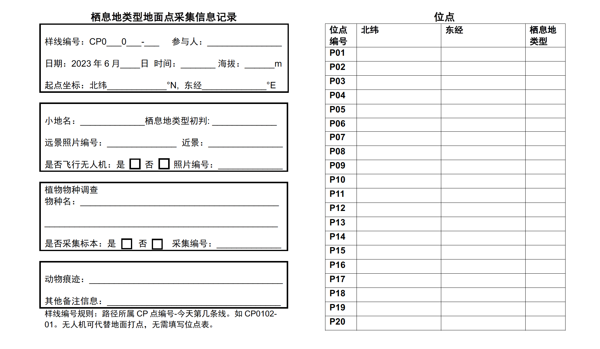

```{r setup, include=FALSE}
knitr::opts_chunk$set(echo = FALSE, warning = F, message = F)
library(sf)
library(tidyverse)
library(tidyterra)
library(terra)
library(ggspatial)
library(showtext)
```

Remote sensing has been widely used in large-scale land use and land cover classification. I used Sentinel-2 images to identify habitat types in Suli County in the western Qilian mountains. Supervised classification is an ideal choice when providing much training data and with limited computing ability. Therefore, I need to **collect ground points** covering all habitat categories, as well as **plant species composition** in different habitats, to equip my classification results with biological meanings. Besides, **plant specimen** will be useful when I am conducting dietary analysis of local herbivores.

## Sampling design

I manually set 9 control points (hereafter CP) to distribute daily routes better. Altogether there are eight routes between each two CPs (CP01-02, CP02-03, CP03-04, CP04-05, CP05-06, CP05-07, CP07-08, CP08-09). Each route is approximately 25 km. All routes are distributed evenly in land cover types.

```{r, echo = FALSE,warning = F, message = F}
veg <- read_sf("downloaded-datasets/Vegetation-map/vegemap-layer.shp")
suli <- read_sf("downloaded-datasets/Suli/suli.shp")

veg_suli <- veg %>% st_make_valid() %>% st_intersection(y = suli) 

veg_suli <- veg_suli %>% mutate(Landcover = dplyr::case_when( 
                                           zbxz == "草甸" ~ "Steppe",
                                           zbxz == "无植被地段" ~ "Bareland",
                                           zbxz == "高山植被" ~ "Alpine Vegetation",
                                           zbxz == "荒漠" ~ "Sparse Vegetation",
                                           zbxz == "草原" ~ "Grassland",
                                           zbxz == "灌丛" ~ "Shrubland"))

tele_road <- read_sf("downloaded-datasets/tele_road/祁连山通车道路_202111.kml") %>% st_transform(crs(suli)) %>% st_intersection(suli)
cp <- read_sf("Manual/Control_Point.kml") %>% st_cast("POINT") %>% mutate(Name = paste0("CP",1:9))


ggplot() + layer_spatial(data = veg_suli, aes(fill =Landcover )) + geom_sf(data = tele_road, color = "black") + geom_sf(data = cp, color = "white")+ geom_sf_text(data = cp, aes(label = Name), nudge_y = 0.05, size = 2, color = "white")  + theme_bw() + labs(fill = "Landcover")

habitat <- rast("maps/NDVI-defined_habitat.tif")
values(habitat) <- as.factor(as.integer(values(habitat)))
ggplot() + geom_spatraster(data = habitat) + scale_fill_manual(values = c("grey50","#E2C222", "#38A801"), na.value = NA) + geom_sf(data = tele_road, color = "black") + geom_sf(data = cp, color = "white")+ geom_sf_text(data = cp, aes(label = Name), nudge_y = 0.05, size = 2, color = "white")  + theme_bw() + labs(fill = "NDVI-defined habitat")
```

I plan to choose 5 to 8 transects for each route to represent typical habitat types, spacing at 2 km at least. Transects are actual movement tracks of filed staff, and will not be planned in advance. Next, I will record at least 5 sample points (If possible, 20 points at most) along each transect, spacing at least 100 m with each other (the minimal resolution of Sentinel-2 bands is 60 m). Considering there may be some transects that are difficult to access, I will use Unmanned Aerial Vehicle (UAV) to take pictures and identify habitat types later. The form designed to record all information is attached below:



Apart from sampling ground points for habitat classification, I also plan to identify plants along each transect and collect specimens for each species. All tools needed for making specimens are prepared well.

## Workload

I plan to sample 1 to 2 routes each day. Thus, all work should be done within seven days at most, and can be shortened to fewer days.

Day1: CP01-02

Day2: CP02-03

Day3: CP03-04

Day4: CP04-05

Day5: CP05-06, CP05-07

Day6: CP07-08

Day7: CP08-09

